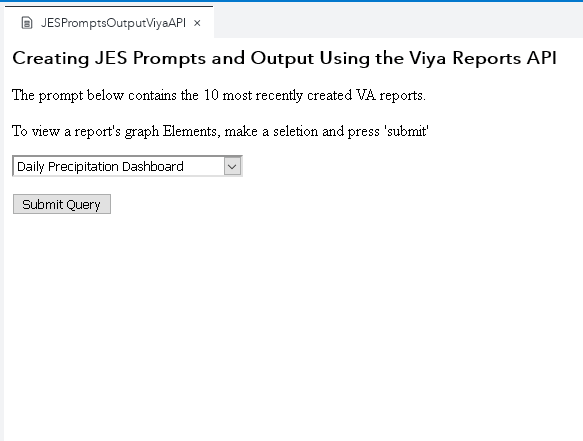

# Creating JES Prompts and Output Using the Viya Reports API

One of the best features of the [SAS Viya Job Execution Service](https://go.documentation.sas.com/?cdcId=jobexeccdc&cdcVersion=2.2&docsetId=jobexecug&docsetTarget=titlepage.htm&locale=en#p0izfftsr05kf6n1barcj6t2pxid) is the ability to interact with the Viya Rest APIs.  This example incorporates request calls to the Viya Reports API from both the JES's custom HTML as well as the JES's source code.  

When the job is called, it first shows some custom HTML.  From this HTML page an XMLHttpRequest request is made to the Viya Reports API to get a list of the ten most recently created Visual Analytics reports in the Viya environment.  The response from the API is then used to populate an HTML drop down from which the user can make a selection.  After the user makes their selection it will be passed to the job's SAS code and another request is made to the Viya Reports API to get the visual elements that are contained within the report.  Finally, we will display a table of only the Graph type elements to the user.

The following animation shows this example JES job in action:

This directory contains the resources that you need to recreate this example:

- A JSON file that contains the completed JES Job,
  `JESPromptsOutputViyaAPI.json`.

  A SAS administrator can import the job into a SAS Viya 3.5 (or later)
  environment using
  [these instructions](https://go.documentation.sas.com/?docsetId=calpromotion&docsetTarget=n0djzpossyj6rrn1vvi1wfvp2qhp.htm&docsetVersion=3.5&locale=en#p1h997oay4wsjon1uby6m99zzhsx).

- The JES job's SAS source code to create the ODS output,
  `JESPromptsOutputViyaAPI.sas`.
- The JES job's HTML code to create prompts and execute the job,
  `JESPromptsOutputViyaAPI.html`.

Save all the code in a SAS Job Execution Web Application 2.2 job definition
within a Viya 3.5 environment. The job must be executed with the parameter:
`_action=form,execute`.
