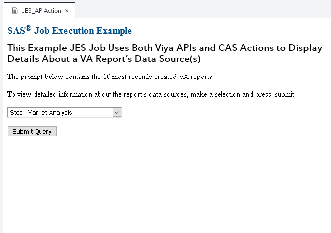

# Job Execution Service Example: Using SAS Viya APIs and CAS Actions to Retrieve Details About Visual Analytics Report Data Sources

One of the things I like best about creating applications in the
[SAS Viya Job Execution Service](https://go.documentation.sas.com/?cdcId=jobexeccdc&cdcVersion=2.2&docsetId=jobexecug&docsetTarget=titlepage.htm&locale=en#p0izfftsr05kf6n1barcj6t2pxid)
is the ability to leverage all of the goodies that SAS Viya has to offer.
Developers can use the JES environment to make API calls to the SAS Viya
services, use the powerful
[CAS actions sets](https://go.documentation.sas.com/?docsetId=pgmdiff&docsetTarget=p06ibhzb2bklaon1a86ili3wpil9.htm&docsetVersion=3.5&locale=en)
and even run
[SAS Viya procedures](https://go.documentation.sas.com/?docsetId=pgmdiff&docsetTarget=n16pcp93f99tsen11ks9rgnongpw.htm&docsetVersion=3.5&locale=en)!

This repository contains an example JES job that performs the following steps:

- First, the job prompts enable users to select a Visual Analytics report from a
  drop-down menu.
- After a selection is made, the job uses API calls to retrieve a listing of the
  report's data sources and determine whether those data sources are currently
  loaded into memory.
- After determining the data sources, the job runs a CAS action on each of the
  report data sources to retrieve its total columns, rows and determine whether
  the data was loaded into CAS using the compress option.

The following animation shows this example JES job in action:

This directory contains the resources that you need to re-create this example:

- A JSON file that contains the completed JES Job, `JES_APIAction.json`.

  A SAS administrator can import the job into a SAS Viya 3.5 (or later)
  environment using
  [these instructions](https://go.documentation.sas.com/?docsetId=calpromotion&docsetTarget=n0djzpossyj6rrn1vvi1wfvp2qhp.htm&docsetVersion=3.5&locale=en#p1h997oay4wsjon1uby6m99zzhsx).

- The JES job's SAS source code to create the ODS output, `JES_APIAction.sas`.
- The JES job's HTML code to create prompts and execute the job,
  `JES_APIAction.html`.

Save all the code in a SAS Job Execution Web Application 2.2 job definition
within a SAS Viya 3.5 environment. The job must be executed with the parameter:
`_action=form,execute`.
