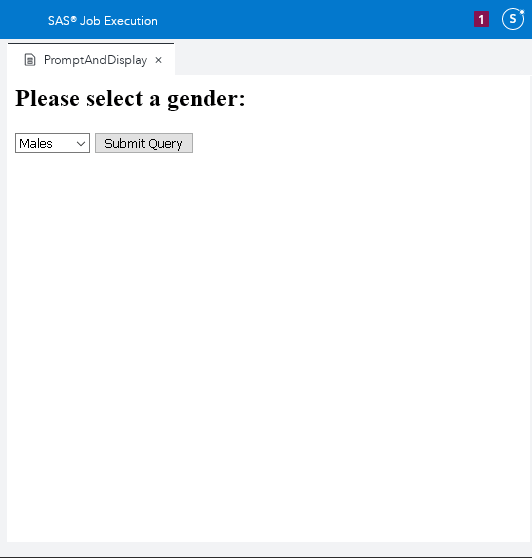

# SAS Viya Job Execution Service with JavaScript

Version 2.2 of the
[SAS Viya Job Execution Service](https://go.documentation.sas.com/?cdcId=jobexeccdc&cdcVersion=2.2&docsetId=jobexecug&docsetTarget=titlepage.htm&locale=en#p0izfftsr05kf6n1barcj6t2pxid)
has some fantastic new features that can enable developers to create custom
applications to meet specific reporting needs. This version delivers the ability
to store HTML input forms, prompts, and source code within a single job
definition. When you copy or move a job, all these elements move with it.

The example in this folder demonstrates the use of JavaScript to interact with
the SAS Job Execution Service (JES).

- First, the user selects either Males or Females from the menu. JavaScript is
  then used to submit the form's selection using the POST method.
- The JES job then receives the selected value and leverages it as a macro in
  the SAS code that is stored within the job's definition.
- Finally, the output is displayed in a DIV element.

The following animation shows this example JES job in action:

This directory contains the resources that you need to recreate this example:

- A JSON file that contains the completed JES Job,
  `executingJESUsingJavaScript.json`.

  A SAS administrator can import the job into a SAS Viya 3.5 (or later)
  environment using
  [these instructions](https://go.documentation.sas.com/?docsetId=calpromotion&docsetTarget=n0djzpossyj6rrn1vvi1wfvp2qhp.htm&docsetVersion=3.5&locale=en#p1h997oay4wsjon1uby6m99zzhsx).

- The JES job's SAS source code to create the ODS output,
  `executingJESUsingJavaScript.sas`.
- The JES job's HTML code to create prompts and execute the job,
  `executingJESUsingJavaScript.html`.

Save all the code in a SAS Job Execution Web Application 2.2 job definition
within a Viya 3.5 environment. The job must be executed with the parameter:
`_action=form,execute`.
