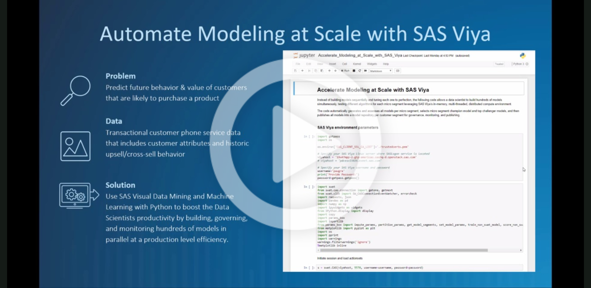

# Automate Modeling at Scale with SAS Viya

Watch the video to see the flow of the demo.

## Project Content

1.	Identify data, models to run and variables to use for segmentation
2.	Segment data and upload them into separate sessions using swat
3.	For each segment, train all the chosen models (Total # of models = # segments x # unique models)
4.  Score, Assess and generate ROC & Lift charts for each segment
5.  Using missclassification, identify champion and challenger models for each segment
6.  Register all the models from each segment and label champion/challenger in SAS Model Manager

## Additional Information

-   python requirements are specified in Requirements.txt
